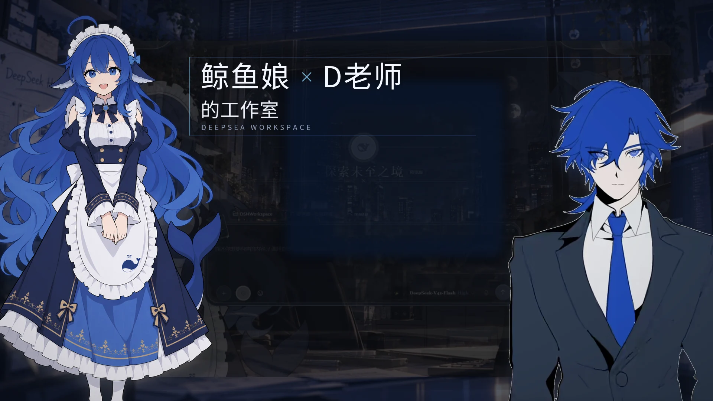
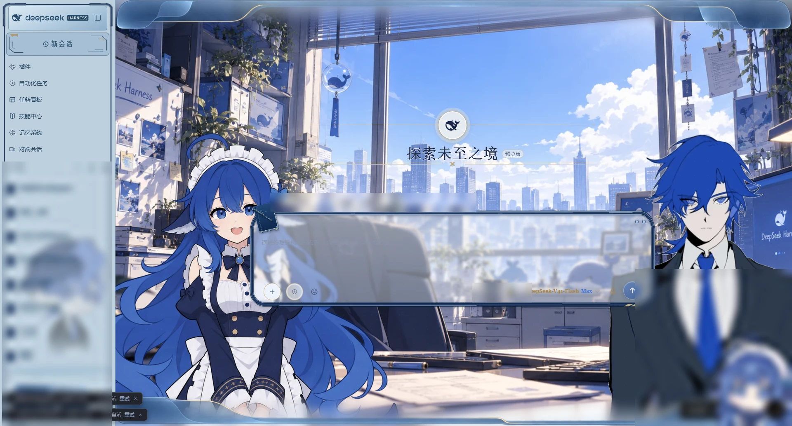
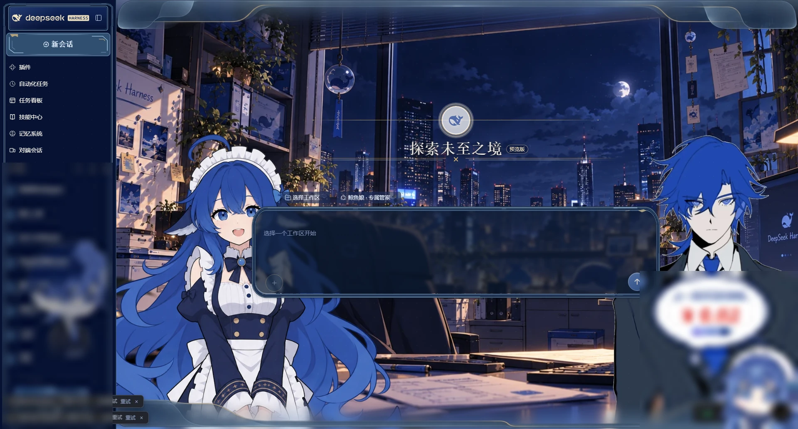
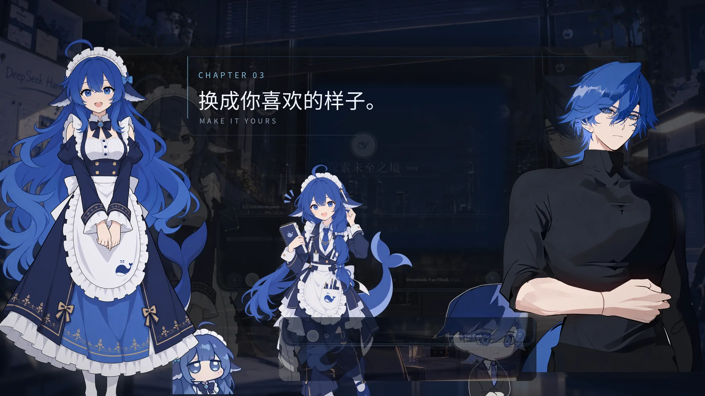
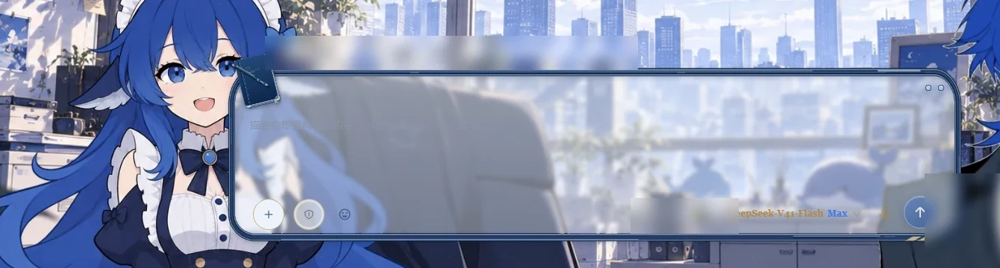
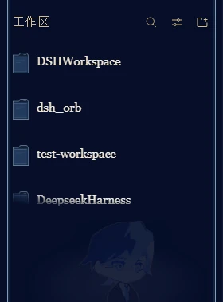

<div align="center">



# DeepSea Workspace

### 鲸鱼娘 × D老师 的工作室

A dual-character theme workspace skin built for the DeepSeek Harness Web GUI.
An office backdrop, matched light and dark palettes, two independently placed character slots,
and a chibi who lives in the sidebar.

`[中文](README.md) | English`


[](LICENSE)
[](LICENSE-ARTWORK)

</div>

---

## About

A **presentation-layer only** client skin plugin. It injects nothing server-side, emits no Cordis events,
and never touches model requests. `apply()` does three things: set a scoped attribute on `<html>`,
swap in the office backdrop for the active theme, and mount the character artwork onto transparent layers.
When the effect is destroyed, every CSS rule and DOM node it wrote is restored.

Derived from [maid-atelier by Small-tailqwq](https://github.com/Small-tailqwq/dsh-deep-whale),
keeping the deep-blue lace skeleton and its attribution chain, with D teacher on the right slot and the
art direction pulled toward a deep-blue office.

## Features

| | |
|---|---|
| **Light & dark** | Follows DSH's theme; the office backdrop, frosted glass and edge trim each come as a matched set. |
| **Two artwork slots** | Whale girl on the left, D teacher on the right by default. Four images per side, or switch a side off entirely. |
| **Per-side mirror** | Each slot flips horizontally on its own. |
| **Sidebar chibi** | Male (D teacher) or female (whale girl); rendered as a background layer behind the workspace list. |
| **Head-height alignment** | Artwork is scaled to a common head height — full-body images share a floor line, busts anchor to the bottom, and the layout is symmetric either way. |
| **Three composer modes** | Always on / idle capsule / hide on scroll up. |
| **Themed UI** | Composer, buttons, sidebar, workspace folders and admin pages all swap as one set. |
| **Mobile layout** | Portrait breakpoint at ≤700px; corner, topbar and rail navigation modes. |

> Extra switches such as the reduced-akimbo mode, conversation font, per-model artwork visibility and
> clean-stage-for-recording live in **Settings → Skin** inside DSH. This README does not repeat them all.

## Light & Dark

<table>
<tr>
<td align="center" width="50%"></td>
<td align="center" width="50%"></td>
</tr>
<tr>
<td align="center">Light Workspace</td>
<td align="center">Dark Workspace</td>
</tr>
</table>

## Characters

### The whale girl

Holds the left slot. Deep blue palette, long hair, apron uniform — visually continuous with the lace UI.
Two variants (standing full body, holding a laptop); the female chibi is her too.

### D teacher

Holds the right slot. A quiet dark suit and tie against her brightness, balancing the two sides.
Two variants (suit, black turtleneck); the male chibi defaults to him.



The four images are: whale girl (standing full body), whale girl with laptop, D teacher (suit),
D teacher (black turtleneck). Any of them can go in either slot; use the mirror flip when you put the
same image on both sides.

## Details

<table>
<tr>
<td align="center"></td>
<td align="center"></td>
</tr>
<tr>
<td align="center">Composer: layered blue frame with a side-hung notebook</td>
<td align="center">Sidebar chibi (background layer)</td>
</tr>
</table>

## Installation

This package is a plain DSH plugin bundle. No build step, no `pnpm install`.

1. **Download or clone this repository** to get the `skin-d-atelier/` directory.
2. **Add it to your DSH profile:**

   ```powershell
   dsh plugin --profile web add <path containing skin-d-atelier>
   ```

   `<path>` is the directory that **contains `package.json`**, not the repository root.
   During local development a `link:` form also works:
   `dsh plugin --profile web add link:/abs/path/to/skin-d-atelier`.

3. **Restart DSH once.**
4. **Enable the skin** from the skin manager in settings, choosing
   “鲸鱼娘 × D老师 的工作室”. It is **mutually exclusive** with the maid-atelier base skin.

> **Verified on** DSH `0.2.0-rc.2`. Other versions are **not verified**.
> `dsh plugin` forwards to pnpm inside the profile directory; adjust the profile name to match yours.

## Usage

After enabling, adjust these under **Settings → Skin**. Changes reload through config; a restart is
usually not needed:

- **Left / right artwork** — any of four, or off
- **Left / right mirror** — per side
- **Sidebar chibi** — male / female
- **Show both artworks** — master switch
- **Composer mode** — always on / idle capsule / hide on scroll
- **Mobile navigation** — corner / topbar / rail

Light and dark follow DSH's own theme setting; nothing to switch here.

**Back to default**: disable the skin in the same manager, or turn off its entry.
Effect teardown restores all styling — no need to uninstall the plugin.

## Compatibility

| | |
|---|---|
| DSH version | `0.2.0-rc.2` verified; `0.1.x` and other RCs **not verified** |
| Platform | Windows 11 with Chrome / Electron |
| Resolution | Desktop 1920×1034 baseline; artwork and trim scale with the window, with tighter gaps on narrow windows |
| Other skins | Mutually exclusive with maid-atelier and deep-whale-manager |
| Mobile | Portrait breakpoint at ≤700px, three navigation modes |

## Known limitations

- The official skin centre (`web-ui-skin-center`) and the base deep-whale manager **cannot both be
  enabled** — symptoms are a missing settings button or a scrambled sidebar. This package assumes you
  run exactly one of them.
- Artwork alignment relies on built-in head-metrics constants; swapping an image requires recomputing them.
- Recording requires manually hiding the balance pill, mini-game launcher and whale widget via the
  clean-stage switch.
- The demo video is not bundled in this repository; it ships as a Release asset (see below).

## Project structure

```text
skin-d-atelier/
├─ lib/
│  ├─ index.js        # plugin entry
│  └─ client.js       # skin runtime (prebuilt, artwork embedded)
├─ preview/           # light / dark previews shown by the skin manager
├─ assets/icons/      # app icons
├─ docs/images/       # README artwork
├─ skin.json          # skin metadata
├─ cordis.patch.yml   # plugin registration patch
├─ LICENSE            # MIT for code + statement that artwork is excluded
├─ LICENSE-ARTWORK    # CC BY-NC-SA 4.0 for artwork
└─ NOTICE             # per-asset provenance, hashes and attribution chain
```

## Demo video

The reel is not committed to this repository — a 14 MB binary should not ride along in Git history.
It lives in the **Assets of the v1.0.0 Release**: open the repository's **Releases** page and download
`MASTER-v6-FINAL-MIX-v3.mp4`.

| | |
|---|---|
| Spec | 1920×1080 / 30 fps / 1297 frames / ≈43.2 s |
| Codec | H.264 + AAC 48 kHz stereo |
| Size | 14,382,939 B (≈13.7 MB) |
| SHA-256 | `f424f0382ae29e4c6d3f250bd5d195f28d0e3719cd36a0d4460dc43b749f010e` |

You can verify the SHA-256 after downloading to confirm you have the original master.
Music credits are in [docs/MEDIA-CREDITS.md](docs/MEDIA-CREDITS.md).

## Credits & licensing

Three layers are stacked here, and redistribution has to satisfy all of them:

- **Code and UI skeleton** — MIT, Copyright (c) 2026 Small-tailqwq (the maid-atelier base)
- **Atelier decoration assets (chain A)** — CC BY-NC-SA 4.0
  上善 → ZipZipPipe → Small-tailqwq; attribution must be preserved verbatim
- **D teacher assets (chain B)** — by 子午, publicly released for non-commercial use; this repository
  contains no monetisation surface

The two female artwork variants were newly produced with AI image tools for this project and are not
derived from any of the above. Full per-asset provenance, SHA-256 hashes and processing notes are in
[NOTICE](NOTICE).

**The licences are separate**:

- Code, scripts, configuration → [MIT](LICENSE)
- Artwork, character art, backgrounds, icons, previews (including AI-generated and AI-assisted) →
  [CC BY-NC-SA 4.0](LICENSE-ARTWORK), **non-commercial only**

Bundling artwork into `lib/` as CSS or base64 does **not** change its licence. Rights holders may ask
for removal at any time.

### Tooling

The project scaffold (directory template and build preset) comes from
[zhu1090093659/dsh-web-ui](https://github.com/zhu1090093659/dsh-web-ui) by Solitude.
This repository distributes the **built artifact** only — patch scripts and the build pipeline are not included.

The demo reel's music, “Bright Bell Motif”, was generated with [Suno AI](https://suno.com/s/qNyElpaJUK0jTZ4Z).
Per-item provenance is listed in [docs/MEDIA-CREDITS.md](docs/MEDIA-CREDITS.md).
